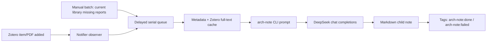

# Architecture

The Zotero runtime integration lives in `chrome/content/arch-note-zotero.js`.

The model-facing and note-rendering code is intentionally pure JavaScript:

- `chrome/content/prompt.js`
- `chrome/content/skill-runner.js`
- `chrome/content/deepseek-client.js`
- `chrome/content/markdown.js`

Those modules are loaded both by Zotero and by Node tests.
