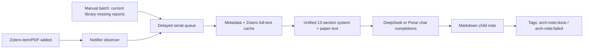

# Architecture

```mermaid
flowchart LR
  A["Zotero item/PDF added"] --> B["Notifier observer"]
  Z["Manual batch: current library missing reports"] --> C
  B --> C["Delayed serial queue"]
  C --> D["Metadata + Zotero full-text cache"]
  D --> P["Unified 13-section system + paper text"]
  P --> F["DeepSeek or Poixe chat completions"]
  F --> G["Markdown child note"]
  G --> H["Tags: arch-note:done / arch-note:failed"]
```

The Zotero runtime integration lives in `chrome/content/arch-note-zotero.js`.

The model-facing and note-rendering code is intentionally pure JavaScript:

- `chrome/content/prompt.js`
- `chrome/content/deepseek-client.js`
- `chrome/content/markdown.js`

Those modules are loaded both by Zotero and by Node tests.

`prompt.js` owns the system prompt for all generation paths and validates the 13 numbered sections before saving. The plugin reads Zotero-indexed PDF text directly. Legacy skill, format, and style preferences have no effect. No external CLI is loaded or executed.

Runtime modules are loaded with `ignoreCache: true` to avoid retaining old subscript code during updates. Generated notes record the provider, endpoint, model, plugin version, and prompt revision. Request diagnostics omit API keys, URL query parameters, and paper contents.

`deepseek-client.js` supports both DeepSeek and Poixe using OpenAI-compatible Chat Completions. The DeepSeek preference keys are preserved for existing installations. Poixe uses separate `poixeApiKey`, `poixeBaseUrl`, and `poixeModel` preferences. `apiProvider` selects the active profile; requests do not fall back to another provider's key.

Poixe requests use `/v1/chat/completions`, Bearer authentication, and `max_completion_tokens`. Temperature is omitted to use the upstream model's sampling default. Root, `/v1`, and full Chat Completions URLs are accepted. Secondary Poixe hosts can be configured through Base URL.

The plugin does not provide live web search or a tool-execution loop. The system prompt requires disclosure of this limitation for follow-up research and novelty claims.
